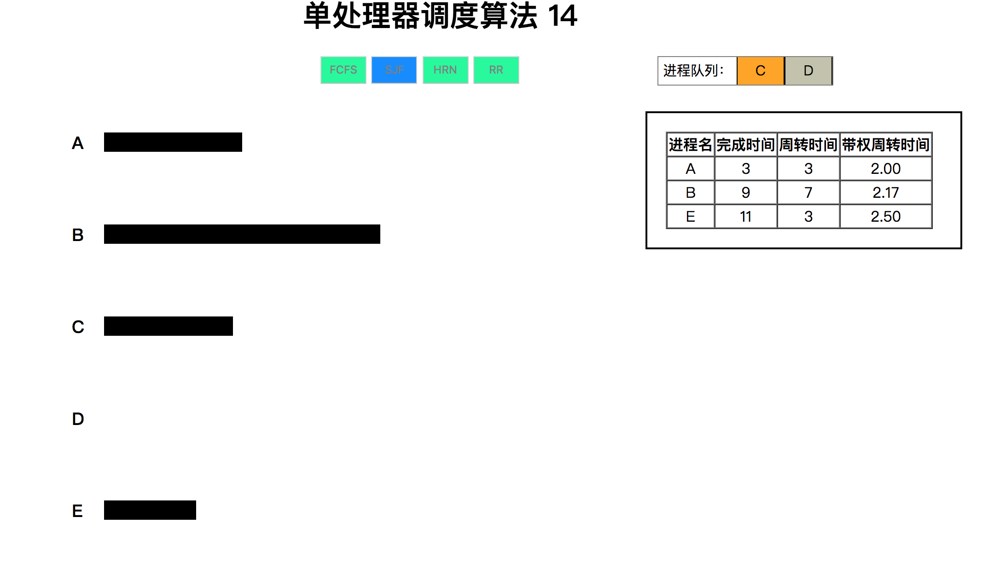

# 单处理器进程调度算法

[pc项目地址](https://Jackson-p.github.io/Single-Process-Handling)

## 问题场景描述

随机给出一个进程调度实例，如:

进程 到达时间 服务时间

>A&nbsp;&nbsp;&nbsp;&nbsp;&nbsp;&nbsp;&nbsp;0&nbsp;&nbsp;&nbsp;&nbsp;&nbsp;&nbsp;&nbsp;&nbsp;&nbsp;&nbsp;&nbsp;&nbsp;&nbsp;3

>B&nbsp;&nbsp;&nbsp;&nbsp;&nbsp;&nbsp;&nbsp;2&nbsp;&nbsp;&nbsp;&nbsp;&nbsp;&nbsp;&nbsp;&nbsp;&nbsp;&nbsp;&nbsp;&nbsp;&nbsp;6

>C&nbsp;&nbsp;&nbsp;&nbsp;&nbsp;&nbsp;&nbsp;4&nbsp;&nbsp;&nbsp;&nbsp;&nbsp;&nbsp;&nbsp;&nbsp;&nbsp;&nbsp;&nbsp;&nbsp;&nbsp;4     

>D&nbsp;&nbsp;&nbsp;&nbsp;&nbsp;&nbsp;&nbsp;6&nbsp;&nbsp;&nbsp;&nbsp;&nbsp;&nbsp;&nbsp;&nbsp;&nbsp;&nbsp;&nbsp;&nbsp;&nbsp;5

>E&nbsp;&nbsp;&nbsp;&nbsp;&nbsp;&nbsp;&nbsp;8&nbsp;&nbsp;&nbsp;&nbsp;&nbsp;&nbsp;&nbsp;&nbsp;&nbsp;&nbsp;&nbsp;&nbsp;&nbsp;&nbsp;2

模拟进程调度，给出按照算法先来先服务 FCFS、轮转 RR(q=1)、 最短进程优先 SJF、最高响应比优先 HRN 进行调度各进程的完成时 间、周转时间、带权周转时间。

## 算法方面：

* FCFS算法：每次队列中都只有一个进程，这个进程结束之后，检查一下还有其他进程到了时间没执行的话，就按序加入

* RR算法：时间片轮转，每次执行1s（这里q为1）的当前进程接着执行下一个，如果当前的进程执行时间已达到标准时间就推出

* SJF算法：这里稍稍改变了写这个算法的思路，每个进程在进入的时候进行优先排序，确定好自己的位置后，当当前进程的finalTime到了之后就征程执行其他进程就好

* HRN算法：这个我写的可能不对。。。。没太看懂书上讲的比较大概，个人理解是遍历所有进程通过1+W/T计算出优先级后，把优先权最高的放进队列，一次只有一个进程，到达当前进程的finalTime时，重新计算剩余进程的优先权选入进程执行

* 作业时间、周转时间等参数在进程从队列中推出时进行保留计算即可

## 其他：

* dispersion中放的算是心路历程和分散算法的代码，最后用到的根目录下的Begin.js是渲染的一些脚本，Process.js是一个各个算法合在一起的模块。

## 效果：

ps:实际上是动态的hhh
